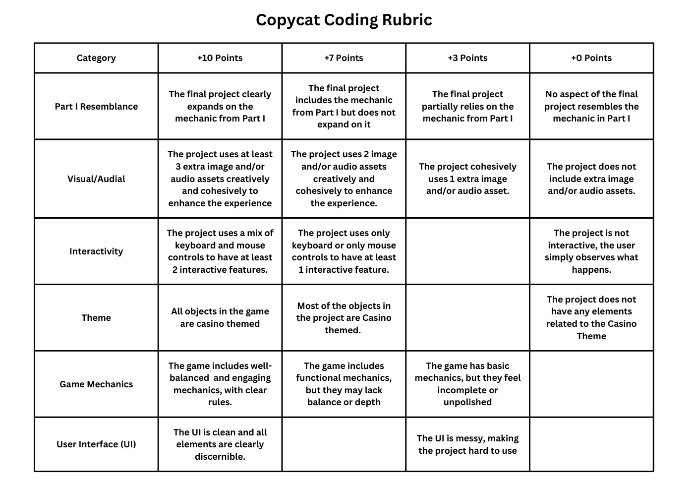

# Geek Games 2025 - Copycat Coding 

## Introduction

Welcome to the Copycat Coding part of Geek Games! You have 1.5 hours to turn a simple program into something interesting and fun, and earn points towards a grand prize!

For this year's Copycat Coding, we'll be using p5.js, a beginner-friendly yet powerful tool to create interactive art and simple games in your web browser. You are tasked with copying a simple bouncing ball program in Part I, before expanding the idea into something imaginative in Part II. 

Here is a link to the [p5.js documentation](https://p5js.org/reference/), which you will need in order to use all of p5.js's tools.

## Get Started

To get started, clone this repository by running the following command in your terminal.

```bash
git clone https://github.com/sbcs/cc-template.git
```
<details>
<summary>
If you get an error running this command, click here.
</summary>
<br />
You likely do not have <code>git</code> installed. To save time, we won't install <code>git</code> here, but we will instead download the starter code manually:


1. Open [github.com/sbcs/cc-template](https://github.com/sbcs/cc-template)
2. Click on the big green `Code` button, and then click `Download ZIP`.
    
3. Save the ZIP somewhere on your machine, and extract its contents.
4. Open the folder using VSCode or another preferred IDE.
5. Get started on Part I below!


</details>

## Part I

The first part of this competition is to copy the simple program shown below:


As you can see, this is a very simple implementation of a ball moving around a square canvas, colliding with the walls. Your job in Part I is to code this program in p5.js, resulting in a small amount of points. You will have the opportunity to earn the majority of your points by expanding this program in Part II. 


## Part II

The majority of your score for Copycat Coding will be earned based on the way you expand the above program into something fun. We're looking for creativity, good design, and interactivity (see the **Rubric** section below)

An example of what's possible is this [casino-themed Brick Breaker game](https://leonrode.github.io/brick-breaker), also made with p5.js using the setup you'll be using in Part I. It expands the ball/collision mechanism into a simple game.

Be creative and have fun!

## Helpful Documentation


* [circle()](https://p5js.org/reference/p5/circle/) - draw a circle (see p5.js reference for more shapes)
* [background()](https://p5js.org/reference/p5/background/) - set the background color
* [fill()](https://p5js.org/reference/p5/fill/) / [noFill()](https://p5js.org/reference/p5/noFill/) - sets/disables the fill color of shapes to be drawn
* [loadImage()](https://p5js.org/reference/p5/loadImage/) - load a local image file into p5.js
    * [image()](https://p5js.org/reference/p5/image/) - draws a loaded image onto the screen
* [keyPressed()](https://p5js.org/reference/p5/keyPressed/) - a function that is called whenever any key is pressed
    * [key](https://p5js.org/reference/p5/key/) - a global string variable containing the last key pressed
* [mouseClicked()](https://p5js.org/reference/p5/mouseClicked/) - a function that is called whenever the mouse is pressed and released (variations exist for separate press or release events)
    * [mouseX](https://p5js.org/reference/p5/mouseX/) / [mouseY](https://p5js.org/reference/p5/mouseY/) - global number variables that contain the x and y coordinates of the mouse **relative to the top-left of the screen** (i.e. (0, 0) is at the top-left corner, (50, 50) is 50 pixels down and right)
    

## Requirements & Rubric

Here are some required aspects of your final project.

1. Your project should be fully based in HTML/CSS/JS and p5.js
2. You cannot use code that you did not write yourself, aside from the examples, tutorials, and code present in the p5.js website and library.
3. Your project in Part II should have some element(s) from the base implementation  present in the final version. This can be in whatever form you want, as long as some aspect of your project comes from Part I.

### Rubric

Below is the rubric that the scorers will use to give you points. Feel free to use the rubric to guide the development of your project!




